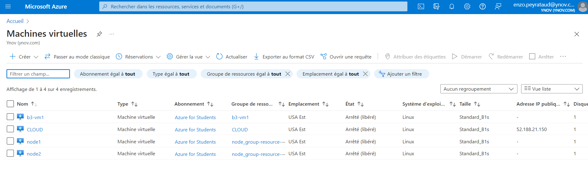
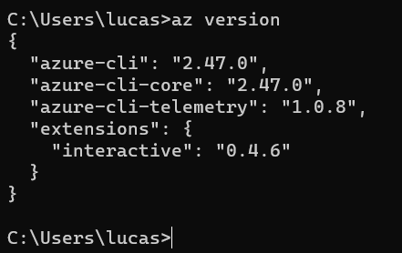

# Terraform

**Dans ce TP on va explorer une utilisation basique de Terraform.**

Dans notre cas, on va utiliser Azure (sorry). On va donc explorer un peu la plateform Azure et ses concepts, avant d'y déployer des machins avec Terraform.

On utilisera ensuite Terraform pour automatiser la création de machines dans Azure.

# Sommaire

- [I. Azure](#i-azure)
  - [1. Une première VM](#1-une-première-vm)
  - [2. Azure CLI](#2-azure-cli)
- [II. Terraform](#ii-terraform)
  - [1. Do it](#2-do-it)
  - [2. Do it yourself](#3-do-it-yourself)

# I. Azure

## 1. Une première VM

Ci-dessous les VM crées lors du TP ( y compris la première se nommant **CLOUD** )



## 2. Azure CLI



# II. Terraform

## 1. Do it

📁 Fichier **tp4/partie_1/main.tf`**

[https://tonlienmescouilles](https://github.com/EPEYRATAUD/b3-cloud-2023/blob/main/tp4/partie_1/main.tf)

- _Récupération du provider azurerm :_

```
C:\Users\lucas\B3-2022-2023\b3-cloud - Jonction\tp4>terraform init

Initializing the backend...

Initializing provider plugins...
- Finding hashicorp/azurerm versions matching ">= 3.0.0"...
- Installing hashicorp/azurerm v3.50.0...
- Installed hashicorp/azurerm v3.50.0 (signed by HashiCorp)

[...]

Terraform has been successfully initialized!

[...]
```

- _Vérification de la validité du plan :_

```
C:\Users\lucas\B3-2022-2023\b3-cloud - Jonction\tp4>terraform plan

Terraform used the selected providers to generate the following execution plan. Resource actions are indicated with the following symbols:
  + create

Terraform will perform the following actions:

  # azurerm_linux_virtual_machine.vm-b3-vm1 will be created
  + resource "azurerm_linux_virtual_machine" "vm-b3-vm1" {
      + admin_username                  = "targa"
      + allow_extension_operations      = true
      + computer_name                   = (known after apply)
      + disable_password_authentication = true
      + extensions_time_budget          = "PT1H30M"
      + id                              = (known after apply)
      + location                        = "eastus"
      + max_bid_price                   = -1
      + name                            = "b3-vm1"
      + network_interface_ids           = (known after apply)
      + patch_assessment_mode           = "ImageDefault"
      + patch_mode                      = "ImageDefault"
      + platform_fault_domain           = -1
      + priority                        = "Regular"
      + private_ip_address              = (known after apply)
      + private_ip_addresses            = (known after apply)
      + provision_vm_agent              = true
      + public_ip_address               = (known after apply)
      + public_ip_addresses             = (known after apply)
      + resource_group_name             = "b3-vm1"
      + size                            = "Standard_B1s"
      + virtual_machine_id              = (known after apply)

      + admin_ssh_key {
          + public_key = "ssh-rsa AAAAB3NzaC1yc2EAAAADAQABAAABgQDYrb/iNaFzOZxpY62Y0o5/uiKB8jq6GUxHbre+qMOTC2x1vcyRm6+snPbwpcIcy5XrKRmU5FbPpqjVryPXM/tGfsA4b4n5JoHhrEvHPkMQI5kMagyqjw/PSGvy3/0ers1rJUxwf2S5halFml4y56yynm53HfXPCcAMsIlD4R0WcgkttSViycioCmvHc3yzcY5ymw4GsTUjOyrZUbnAPjphRnoliGBfYnYJVPnOhWVZSRPanpuMjjWaw2VILlTO6FA+Dp4KiUFEx4eNcim9iU+llNrJTsFd4LvEyk24QQKYufSQl6aiAc2Z1pU0U++PO4i1hg0AXyFk9pA4vSKd4l+jrymZpJVWnTfAuet3RQUhVrzHHhTZZI6z8WBpg0xORMxhBf6UanST3n6/lNfgAkqyevNP4Mlne7Sx1gB+lWZmLRPNuu72jCALVLWgMIPhm33KtnhYgoT3OnGERMKjgmDl3zURl351YRrXjPiEDpvrb2YO9zNy9k72h1rCLZyOvb0= lucas@LAPTOP-JHK9K6A7"
          + username   = "targa"
        }

      + os_disk {
          + caching                   = "ReadWrite"
          + disk_size_gb              = (known after apply)
          + name                      = (known after apply)
          + storage_account_type      = "Standard_LRS"
          + write_accelerator_enabled = false
        }

      + source_image_reference {
          + offer     = "UbuntuServer"
          + publisher = "Canonical"
          + sku       = "18.04-LTS"
          + version   = "latest"
        }
    }

  # azurerm_network_interface.nic-b3-vm1 will be created
  + resource "azurerm_network_interface" "nic-b3-vm1" {
      + applied_dns_servers           = (known after apply)
      + dns_servers                   = (known after apply)
      + enable_accelerated_networking = false
      + enable_ip_forwarding          = false
      + id                            = (known after apply)
      + internal_dns_name_label       = (known after apply)
      + internal_domain_name_suffix   = (known after apply)
      + location                      = "eastus"
      + mac_address                   = (known after apply)
      + name                          = "example-nic"
      + private_ip_address            = (known after apply)
      + private_ip_addresses          = (known after apply)
      + resource_group_name           = "b3-vm1"
      + virtual_machine_id            = (known after apply)

      + ip_configuration {
          + gateway_load_balancer_frontend_ip_configuration_id = (known after apply)
          + name                                               = "internal"
          + primary                                            = (known after apply)
          + private_ip_address                                 = (known after apply)
          + private_ip_address_allocation                      = "Dynamic"
          + private_ip_address_version                         = "IPv4"
          + subnet_id                                          = (known after apply)
        }
    }

  # azurerm_resource_group.rg-b3-vm1 will be created
  + resource "azurerm_resource_group" "rg-b3-vm1" {
      + id       = (known after apply)
      + location = "eastus"
      + name     = "b3-vm1"
    }

  # azurerm_subnet.s-b3-vm1 will be created
  + resource "azurerm_subnet" "s-b3-vm1" {
      + address_prefixes                               = [
          + "10.0.2.0/24",
        ]
      + enforce_private_link_endpoint_network_policies = (known after apply)
      + enforce_private_link_service_network_policies  = (known after apply)
      + id                                             = (known after apply)
      + name                                           = "internal"
      + private_endpoint_network_policies_enabled      = (known after apply)
      + private_link_service_network_policies_enabled  = (known after apply)
      + resource_group_name                            = "b3-vm1"
      + virtual_network_name                           = "b3-vm1"
    }

  # azurerm_virtual_network.vn-b3-vm1 will be created
  + resource "azurerm_virtual_network" "vn-b3-vm1" {
      + address_space       = [
          + "10.0.0.0/16",
        ]
      + dns_servers         = (known after apply)
      + guid                = (known after apply)
      + id                  = (known after apply)
      + location            = "eastus"
      + name                = "b3-vm1"
      + resource_group_name = "b3-vm1"
      + subnet              = (known after apply)
    }

Plan: 5 to add, 0 to change, 0 to destroy.

───────────────────────────────────────────────────────────────────────────────────────────────────────────────────────────────────────────────────────────

Note: You didn't use the -out option to save this plan, so Terraform can't guarantee to take exactly these actions if you run "terraform apply" now.

```

- _Déploiement du plan :_

```
C:\Users\lucas\B3-2022-2023\b3-cloud - Jonction\tp4>terraform apply

Terraform used the selected providers to generate the following execution plan. Resource actions are indicated with the following symbols:
  + create

Terraform will perform the following actions:

  # azurerm_linux_virtual_machine.vm-b3-vm1 will be created
  + resource "azurerm_linux_virtual_machine" "vm-b3-vm1" {
      + admin_username                  = "targa"
      + allow_extension_operations      = true
      + computer_name                   = (known after apply)
      + disable_password_authentication = true
      + extensions_time_budget          = "PT1H30M"
      + id                              = (known after apply)
      + location                        = "eastus"
      + max_bid_price                   = -1
      + name                            = "b3-vm1"
      + network_interface_ids           = (known after apply)
      + patch_assessment_mode           = "ImageDefault"
      + patch_mode                      = "ImageDefault"
      + platform_fault_domain           = -1
      + priority                        = "Regular"
      + private_ip_address              = (known after apply)
      + private_ip_addresses            = (known after apply)
      + provision_vm_agent              = true
      + public_ip_address               = (known after apply)
      + public_ip_addresses             = (known after apply)
      + resource_group_name             = "b3-vm1"
      + size                            = "Standard_B1s"
      + virtual_machine_id              = (known after apply)

      + admin_ssh_key {
          + public_key = "ssh-rsa AAAAB3NzaC1yc2EAAAADAQABAAABgQDYrb/iNaFzOZxpY62Y0o5/uiKB8jq6GUxHbre+qMOTC2x1vcyRm6+snPbwpcIcy5XrKRmU5FbPpqjVryPXM/tGfsA4b4n5JoHhrEvHPkMQI5kMagyqjw/PSGvy3/0ers1rJUxwf2S5halFml4y56yynm53HfXPCcAMsIlD4R0WcgkttSViycioCmvHc3yzcY5ymw4GsTUjOyrZUbnAPjphRnoliGBfYnYJVPnOhWVZSRPanpuMjjWaw2VILlTO6FA+Dp4KiUFEx4eNcim9iU+llNrJTsFd4LvEyk24QQKYufSQl6aiAc2Z1pU0U++PO4i1hg0AXyFk9pA4vSKd4l+jrymZpJVWnTfAuet3RQUhVrzHHhTZZI6z8WBpg0xORMxhBf6UanST3n6/lNfgAkqyevNP4Mlne7Sx1gB+lWZmLRPNuu72jCALVLWgMIPhm33KtnhYgoT3OnGERMKjgmDl3zURl351YRrXjPiEDpvrb2YO9zNy9k72h1rCLZyOvb0= lucas@LAPTOP-JHK9K6A7"
          + username   = "targa"
        }

      + os_disk {
          + caching                   = "ReadWrite"
          + disk_size_gb              = (known after apply)
          + name                      = (known after apply)
          + storage_account_type      = "Standard_LRS"
          + write_accelerator_enabled = false
        }

      + source_image_reference {
          + offer     = "UbuntuServer"
          + publisher = "Canonical"
          + sku       = "18.04-LTS"
          + version   = "latest"
        }
    }

  # azurerm_network_interface.nic-b3-vm1 will be created
  + resource "azurerm_network_interface" "nic-b3-vm1" {
      + applied_dns_servers           = (known after apply)
      + dns_servers                   = (known after apply)
      + enable_accelerated_networking = false
      + enable_ip_forwarding          = false
      + id                            = (known after apply)
      + internal_dns_name_label       = (known after apply)
      + internal_domain_name_suffix   = (known after apply)
      + location                      = "eastus"
      + mac_address                   = (known after apply)
      + name                          = "example-nic"
      + private_ip_address            = (known after apply)
      + private_ip_addresses          = (known after apply)
      + resource_group_name           = "b3-vm1"
      + virtual_machine_id            = (known after apply)

      + ip_configuration {
          + gateway_load_balancer_frontend_ip_configuration_id = (known after apply)
          + name                                               = "internal"
          + primary                                            = (known after apply)
          + private_ip_address                                 = (known after apply)
          + private_ip_address_allocation                      = "Dynamic"
          + private_ip_address_version                         = "IPv4"
          + subnet_id                                          = (known after apply)
        }
    }

  # azurerm_resource_group.rg-b3-vm1 will be created
  + resource "azurerm_resource_group" "rg-b3-vm1" {
      + id       = (known after apply)
      + location = "eastus"
      + name     = "b3-vm1"
    }

  # azurerm_subnet.s-b3-vm1 will be created
  + resource "azurerm_subnet" "s-b3-vm1" {
      + address_prefixes                               = [
          + "10.0.2.0/24",
        ]
      + enforce_private_link_endpoint_network_policies = (known after apply)
      + enforce_private_link_service_network_policies  = (known after apply)
      + id                                             = (known after apply)
      + name                                           = "internal"
      + private_endpoint_network_policies_enabled      = (known after apply)
      + private_link_service_network_policies_enabled  = (known after apply)
      + resource_group_name                            = "b3-vm1"
      + virtual_network_name                           = "b3-vm1"
    }

  # azurerm_virtual_network.vn-b3-vm1 will be created
  + resource "azurerm_virtual_network" "vn-b3-vm1" {
      + address_space       = [
          + "10.0.0.0/16",
        ]
      + dns_servers         = (known after apply)
      + guid                = (known after apply)
      + id                  = (known after apply)
      + location            = "eastus"
      + name                = "b3-vm1"
      + resource_group_name = "b3-vm1"
      + subnet              = (known after apply)
    }

Plan: 5 to add, 0 to change, 0 to destroy.

Do you want to perform these actions?
  Terraform will perform the actions described above.
  Only 'yes' will be accepted to approve.

  Enter a value: yes

azurerm_resource_group.rg-b3-vm1: Creating...
azurerm_resource_group.rg-b3-vm1: Creation complete after 2s [id=/subscriptions/6a8c9233-ddbd-4769-b389-a6cbabe5acac/resourceGroups/b3-vm1]
azurerm_virtual_network.vn-b3-vm1: Creating...
azurerm_virtual_network.vn-b3-vm1: Creation complete after 7s [id=/subscriptions/6a8c9233-ddbd-4769-b389-a6cbabe5acac/resourceGroups/b3-vm1/providers/Microsoft.Network/virtualNetworks/b3-vm1]
azurerm_subnet.s-b3-vm1: Creating...
azurerm_subnet.s-b3-vm1: Creation complete after 5s [id=/subscriptions/6a8c9233-ddbd-4769-b389-a6cbabe5acac/resourceGroups/b3-vm1/providers/Microsoft.Network/virtualNetworks/b3-vm1/subnets/internal]
azurerm_network_interface.nic-b3-vm1: Creating...
azurerm_network_interface.nic-b3-vm1: Creation complete after 3s [id=/subscriptions/6a8c9233-ddbd-4769-b389-a6cbabe5acac/resourceGroups/b3-vm1/providers/Microsoft.Network/networkInterfaces/example-nic]
azurerm_linux_virtual_machine.vm-b3-vm1: Creating...
azurerm_linux_virtual_machine.vm-b3-vm1: Still creating... [10s elapsed]
azurerm_linux_virtual_machine.vm-b3-vm1: Still creating... [20s elapsed]
azurerm_linux_virtual_machine.vm-b3-vm1: Still creating... [30s elapsed]
azurerm_linux_virtual_machine.vm-b3-vm1: Still creating... [40s elapsed]
azurerm_linux_virtual_machine.vm-b3-vm1: Still creating... [50s elapsed]
azurerm_linux_virtual_machine.vm-b3-vm1: Creation complete after 50s [id=/subscriptions/6a8c9233-ddbd-4769-b389-a6cbabe5acac/resourceGroups/b3-vm1/providers/Microsoft.Compute/virtualMachines/b3-vm1]

Apply complete! Resources: 5 added, 0 changed, 0 destroyed.

```

- _Constater le déploiement :_

```
C:\Users\lucas\B3-2022-2023\b3-cloud - Jonction\tp4>az vm list -o table
Name    ResourceGroup    Location    Zones
------  ---------------  ----------  -------
b3-vm1  B3-VM1           eastus
CLOUD   CLOUD            eastus
```

## 2. Do it yourself

📁 Fichier **tp4/partie_2/main.tf`**

[https://tonlienmescouilles](https://github.com/EPEYRATAUD/b3-cloud-2023/blob/main/tp4/partie%202/plan_2.tf)

- _Récupération du provider azurerm :_

```
C:\Users\lucas\B3-2022-2023\b3-cloud - Jonction\tp4\partie 2>terraform init

Initializing the backend...

Initializing provider plugins...
- Reusing previous version of hashicorp/azurerm from the dependency lock file
- Using previously-installed hashicorp/azurerm v3.50.0

Terraform has been successfully initialized!
[...]

```

- _Vérification de la validité du plan :_

```
C:\Users\lucas\B3-2022-2023\b3-cloud - Jonction\tp4\partie 2>terraform plan
azurerm_resource_group.node_group: Refreshing state... [id=/subscriptions/6a8c9233-ddbd-4769-b389-a6cbabe5acac/resourceGroups/node_group-resource-group]
azurerm_virtual_network.vn-node_group: Refreshing state... [id=/subscriptions/6a8c9233-ddbd-4769-b389-a6cbabe5acac/resourceGroups/node_group-resource-group/providers/Microsoft.Network/virtualNetworks/vn-node_group]
azurerm_public_ip.node1-public-ip: Refreshing state... [id=/subscriptions/6a8c9233-ddbd-4769-b389-a6cbabe5acac/resourceGroups/node_group-resource-group/providers/Microsoft.Network/publicIPAddresses/node1-public-ip]
azurerm_subnet.s-b3_node: Refreshing state... [id=/subscriptions/6a8c9233-ddbd-4769-b389-a6cbabe5acac/resourceGroups/node_group-resource-group/providers/Microsoft.Network/virtualNetworks/vn-node_group/subnets/internal]
azurerm_network_interface.node1-nic: Refreshing state... [id=/subscriptions/6a8c9233-ddbd-4769-b389-a6cbabe5acac/resourceGroups/node_group-resource-group/providers/Microsoft.Network/networkInterfaces/node1-nic]
azurerm_network_interface.node2-nic: Refreshing state... [id=/subscriptions/6a8c9233-ddbd-4769-b389-a6cbabe5acac/resourceGroups/node_group-resource-group/providers/Microsoft.Network/networkInterfaces/node2-nic]
azurerm_linux_virtual_machine.node2: Refreshing state... [id=/subscriptions/6a8c9233-ddbd-4769-b389-a6cbabe5acac/resourceGroups/node_group-resource-group/providers/Microsoft.Compute/virtualMachines/node2]

Terraform used the selected providers to generate the following execution plan. Resource actions are indicated with the following symbols:
  + create

Terraform will perform the following actions:

  # azurerm_linux_virtual_machine.node1 will be created
  + resource "azurerm_linux_virtual_machine" "node1" {
      + admin_username                  = "targa"
      + allow_extension_operations      = true
      + computer_name                   = (known after apply)
      + disable_password_authentication = true
      + extensions_time_budget          = "PT1H30M"
      + id                              = (known after apply)
      + location                        = "eastus"
      + max_bid_price                   = -1
      + name                            = "node1"
      + network_interface_ids           = [
          + "/subscriptions/6a8c9233-ddbd-4769-b389-a6cbabe5acac/resourceGroups/node_group-resource-group/providers/Microsoft.Network/networkInterfaces/node1-nic",
        ]
      + patch_assessment_mode           = "ImageDefault"
      + patch_mode                      = "ImageDefault"
      + platform_fault_domain           = -1
      + priority                        = "Regular"
      + private_ip_address              = (known after apply)
      + private_ip_addresses            = (known after apply)
      + provision_vm_agent              = true
      + public_ip_address               = (known after apply)
      + public_ip_addresses             = (known after apply)
      + resource_group_name             = "node_group-resource-group"
      + size                            = "Standard_B1s"
      + virtual_machine_id              = (known after apply)

      + admin_ssh_key {
          + public_key = "ssh-rsa AAAAB3NzaC1yc2EAAAADAQABAAABgQDYrb/iNaFzOZxpY62Y0o5/uiKB8jq6GUxHbre+qMOTC2x1vcyRm6+snPbwpcIcy5XrKRmU5FbPpqjVryPXM/tGfsA4b4n5JoHhrEvHPkMQI5kMagyqjw/PSGvy3/0ers1rJUxwf2S5halFml4y56yynm53HfXPCcAMsIlD4R0WcgkttSViycioCmvHc3yzcY5ymw4GsTUjOyrZUbnAPjphRnoliGBfYnYJVPnOhWVZSRPanpuMjjWaw2VILlTO6FA+Dp4KiUFEx4eNcim9iU+llNrJTsFd4LvEyk24QQKYufSQl6aiAc2Z1pU0U++PO4i1hg0AXyFk9pA4vSKd4l+jrymZpJVWnTfAuet3RQUhVrzHHhTZZI6z8WBpg0xORMxhBf6UanST3n6/lNfgAkqyevNP4Mlne7Sx1gB+lWZmLRPNuu72jCALVLWgMIPhm33KtnhYgoT3OnGERMKjgmDl3zURl351YRrXjPiEDpvrb2YO9zNy9k72h1rCLZyOvb0= lucas@LAPTOP-JHK9K6A7"
          + username   = "targa"
        }

      + os_disk {
          + caching                   = "ReadWrite"
          + disk_size_gb              = (known after apply)
          + name                      = "node1-osdisk"
          + storage_account_type      = "Standard_LRS"
          + write_accelerator_enabled = false
        }

      + source_image_reference {
          + offer     = "UbuntuServer"
          + publisher = "Canonical"
          + sku       = "18.04-LTS"
          + version   = "latest"
        }
    }

Plan: 1 to add, 0 to change, 0 to destroy.

───────────────────────────────────────────────────────────────────────────────────────────────────────────────────────────────────────────────

Note: You didn't use the -out option to save this plan, so Terraform can't guarantee to take exactly these actions if you run "terraform apply"
now.
```

- _Déploiement du plan :_

```
C:\Users\lucas\B3-2022-2023\b3-cloud - Jonction\tp4\partie 2>terraform apply
azurerm_resource_group.node_group: Refreshing state... [id=/subscriptions/6a8c9233-ddbd-4769-b389-a6cbabe5acac/resourceGroups/node_group-resource-group]
azurerm_virtual_network.vn-node_group: Refreshing state... [id=/subscriptions/6a8c9233-ddbd-4769-b389-a6cbabe5acac/resourceGroups/node_group-resource-group/providers/Microsoft.Network/virtualNetworks/vn-node_group]
azurerm_public_ip.node1-public-ip: Refreshing state... [id=/subscriptions/6a8c9233-ddbd-4769-b389-a6cbabe5acac/resourceGroups/node_group-resource-group/providers/Microsoft.Network/publicIPAddresses/node1-public-ip]
azurerm_subnet.s-b3_node: Refreshing state... [id=/subscriptions/6a8c9233-ddbd-4769-b389-a6cbabe5acac/resourceGroups/node_group-resource-group/providers/Microsoft.Network/virtualNetworks/vn-node_group/subnets/internal]
azurerm_network_interface.node2-nic: Refreshing state... [id=/subscriptions/6a8c9233-ddbd-4769-b389-a6cbabe5acac/resourceGroups/node_group-resource-group/providers/Microsoft.Network/networkInterfaces/node2-nic]
azurerm_network_interface.node1-nic: Refreshing state... [id=/subscriptions/6a8c9233-ddbd-4769-b389-a6cbabe5acac/resourceGroups/node_group-resource-group/providers/Microsoft.Network/networkInterfaces/node1-nic]
azurerm_linux_virtual_machine.node2: Refreshing state... [id=/subscriptions/6a8c9233-ddbd-4769-b389-a6cbabe5acac/resourceGroups/node_group-resource-group/providers/Microsoft.Compute/virtualMachines/node2]

Terraform used the selected providers to generate the following execution plan. Resource actions are indicated with the following symbols:
  + create

Terraform will perform the following actions:

  # azurerm_linux_virtual_machine.node1 will be created
  + resource "azurerm_linux_virtual_machine" "node1" {
      + admin_username                  = "targa"
      + allow_extension_operations      = true
      + computer_name                   = (known after apply)
      + disable_password_authentication = true
      + extensions_time_budget          = "PT1H30M"
      + id                              = (known after apply)
      + location                        = "eastus"
      + max_bid_price                   = -1
      + name                            = "node1"
      + network_interface_ids           = [
          + "/subscriptions/6a8c9233-ddbd-4769-b389-a6cbabe5acac/resourceGroups/node_group-resource-group/providers/Microsoft.Network/networkInterfaces/node1-nic",
        ]
      + patch_assessment_mode           = "ImageDefault"
      + patch_mode                      = "ImageDefault"
      + platform_fault_domain           = -1
      + priority                        = "Regular"
      + private_ip_address              = (known after apply)
      + private_ip_addresses            = (known after apply)
      + provision_vm_agent              = true
      + public_ip_address               = (known after apply)
      + public_ip_addresses             = (known after apply)
      + resource_group_name             = "node_group-resource-group"
      + size                            = "Standard_B1s"
      + virtual_machine_id              = (known after apply)

      + admin_ssh_key {
          + public_key = "ssh-rsa AAAAB3NzaC1yc2EAAAADAQABAAABgQDYrb/iNaFzOZxpY62Y0o5/uiKB8jq6GUxHbre+qMOTC2x1vcyRm6+snPbwpcIcy5XrKRmU5FbPpqjVryPXM/tGfsA4b4n5JoHhrEvHPkMQI5kMagyqjw/PSGvy3/0ers1rJUxwf2S5halFml4y56yynm53HfXPCcAMsIlD4R0WcgkttSViycioCmvHc3yzcY5ymw4GsTUjOyrZUbnAPjphRnoliGBfYnYJVPnOhWVZSRPanpuMjjWaw2VILlTO6FA+Dp4KiUFEx4eNcim9iU+llNrJTsFd4LvEyk24QQKYufSQl6aiAc2Z1pU0U++PO4i1hg0AXyFk9pA4vSKd4l+jrymZpJVWnTfAuet3RQUhVrzHHhTZZI6z8WBpg0xORMxhBf6UanST3n6/lNfgAkqyevNP4Mlne7Sx1gB+lWZmLRPNuu72jCALVLWgMIPhm33KtnhYgoT3OnGERMKjgmDl3zURl351YRrXjPiEDpvrb2YO9zNy9k72h1rCLZyOvb0= lucas@LAPTOP-JHK9K6A7"
          + username   = "targa"
        }

      + os_disk {
          + caching                   = "ReadWrite"
          + disk_size_gb              = (known after apply)
          + name                      = "node1-osdisk"
          + storage_account_type      = "Standard_LRS"
          + write_accelerator_enabled = false
        }

      + source_image_reference {
          + offer     = "UbuntuServer"
          + publisher = "Canonical"
          + sku       = "18.04-LTS"
          + version   = "latest"
        }
    }

Plan: 1 to add, 0 to change, 0 to destroy.

Do you want to perform these actions?
  Terraform will perform the actions described above.
  Only 'yes' will be accepted to approve.

  Enter a value: yes

azurerm_linux_virtual_machine.node1: Creating...
azurerm_linux_virtual_machine.node1: Still creating... [10s elapsed]
azurerm_linux_virtual_machine.node1: Still creating... [20s elapsed]
azurerm_linux_virtual_machine.node1: Still creating... [30s elapsed]
azurerm_linux_virtual_machine.node1: Still creating... [40s elapsed]
azurerm_linux_virtual_machine.node1: Still creating... [50s elapsed]
azurerm_linux_virtual_machine.node1: Creation complete after 52s [id=/subscriptions/6a8c9233-ddbd-4769-b389-a6cbabe5acac/resourceGroups/node_group-resource-group/providers/Microsoft.Compute/virtualMachines/node1]

Apply complete! Resources: 1 added, 0 changed, 0 destroyed.
```

- Connexion en ssh vers _node2_ en passant par rebond avec _node1_ :

```
C:\Users\lucas\B3-2022-2023\b3-cloud - Jonction\tp4\partie 2>ssh -J targa@20.185.37.73 targa@10.0.3.5
The authenticity of host '10.0.3.5 (<no hostip for proxy command>)' can't be established.
ECDSA key fingerprint is SHA256:igd0rCQl9ZsiBEzrbQDn8RRWX/C3aGkfOqkOZ5exflk.
Are you sure you want to continue connecting (yes/no/[fingerprint])? yes
Warning: Permanently added '10.0.3.5' (ECDSA) to the list of known hosts.
Linux node2 4.19.0-23-cloud-amd64 #1 SMP Debian 4.19.269-1 (2022-12-20) x86_64

The programs included with the Debian GNU/Linux system are free software;
the exact distribution terms for each program are described in the
individual files in /usr/share/doc/*/copyright.

Debian GNU/Linux comes with ABSOLUTELY NO WARRANTY, to the extent
permitted by applicable law.
targa@node2:~$
```
